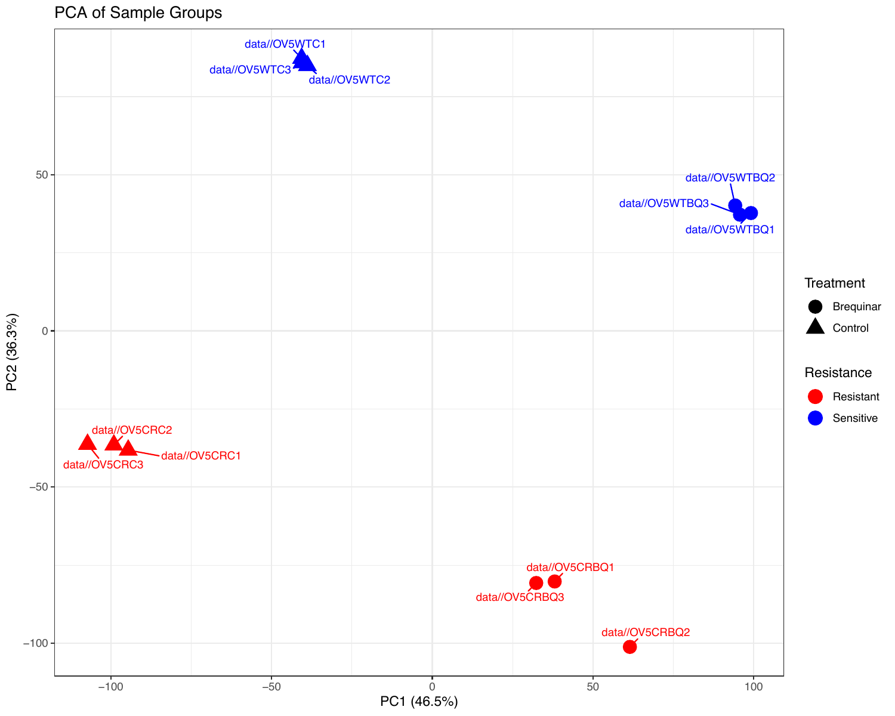
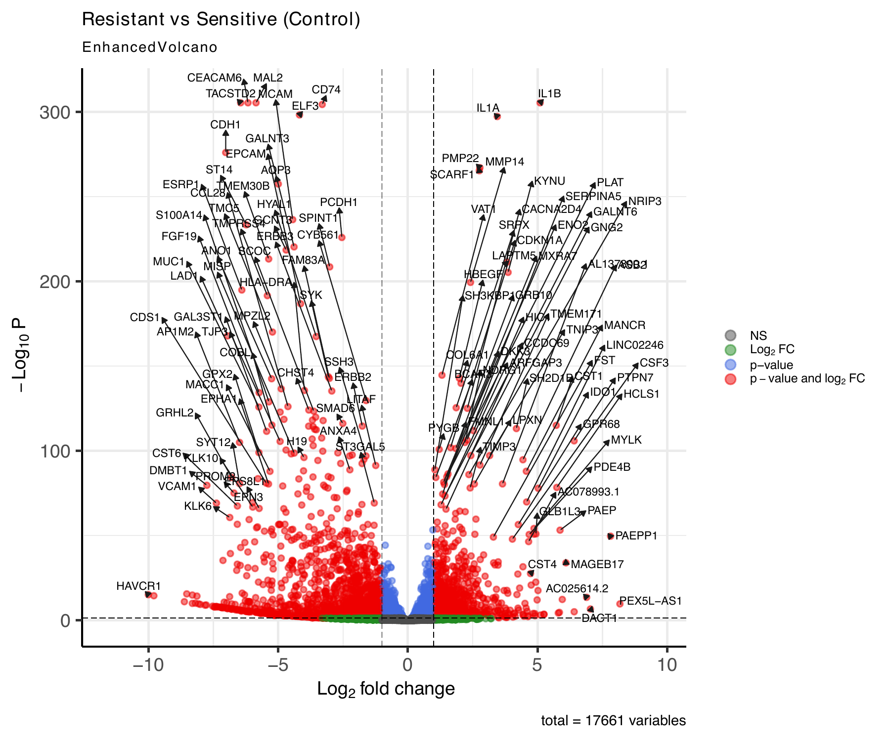

# RNA-seq Analysis: Platinum Resistance in Ovarian Cancer

Differential expression analysis of cisplatin-sensitive and cisplatin-resistant ovarian cancer cells, with targeted evaluation of pyrimidine metabolism and DHODH inhibition response.

## Biological Question

What transcriptional changes drive platinum resistance in ovarian cancer, and does de novo pyrimidine synthesis play a role?

## Dataset

- **Source:** GEO accession [GSE283381](https://www.ncbi.nlm.nih.gov/geo/query/acc.cgi?acc=GSE283381)
- **Cell line:** OVCAR5 (OV5WT = cisplatin-sensitive, OV5CR = cisplatin-resistant)
- **Design:** 4 groups × 3 replicates = 12 samples
  - Sensitive Control, Sensitive + Brequinar
  - Resistant Control, Resistant + Brequinar

## Pipeline

The analysis is fully automated using Snakemake across 7 modular steps:

```
01_load_and_qc.R         -> Count matrix construction, TMM normalization, PCA, QC heatmaps
02_deseq_analysis.R      -> DESeq2 differential expression (4 comparisons)
03_visualization.R       -> Volcano plots, MA plots, heatmaps
04_annotation.R          -> Gene annotation via biomaRt/Ensembl
05_pathway_analysis.R    -> GO and KEGG enrichment (clusterProfiler)
06_pyrimidine_analysis.R -> Targeted 119-gene pyrimidine metabolism analysis
07_biomarker_analysis.R  -> High-confidence biomarker identification
```

## Key Results

| Metric | Value |
|--------|-------|
| Genes analyzed (post-filter) | 17,661 |
| DEGs (resistant vs sensitive) | 5,557 |
| Longest brequinar response | 10,644 genes (60.3%) in resistant cells |
| High-confidence biomarkers | 485 |

**Main finding:** Platinum resistance is driven by epithelial-mesenchymal transition (EMT) and nucleotide salvage pathway upregulation - not increased de novo pyrimidine synthesis as hypothesized. CD73 (NT5E, log2FC = +0.84) emerged as a key resistance marker and potential therapeutic target.




## How to Reproduce

**1. Download data from GEO**
```bash
# Download count files for GSM8661174–GSM8661185 from:
# https://www.ncbi.nlm.nih.gov/geo/query/acc.cgi?acc=GSE283381
# Place .count.out.txt files in data/
```

**2. Install R dependencies**
```r
install.packages("BiocManager")
BiocManager::install(c("DESeq2", "edgeR", "limma", "clusterProfiler",
                       "EnhancedVolcano", "biomaRt", "org.Hs.eg.db"))
install.packages(c("ggplot2", "pheatmap", "ggrepel", "dplyr", "tibble"))
```

**3. Run the full pipeline**
```bash
snakemake --cores 4
```

Or run scripts individually in order:
```bash
Rscript scripts/01_load_and_qc.R
Rscript scripts/02_deseq_analysis.R
# ... and so on
```

## Limitations

- Single cell line model (OVCAR5) — findings require validation in additional models
- Transcriptomic data only - proteomic/metabolomic validation needed
- Small sample size (n=3 per group)

## Reference

Dataset: GSE283381 — Ovarian cancer cisplatin resistance + brequinar treatment RNA-seq
